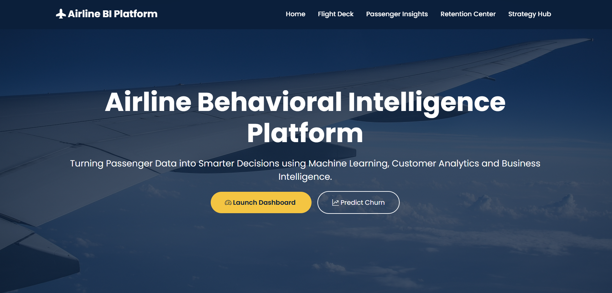
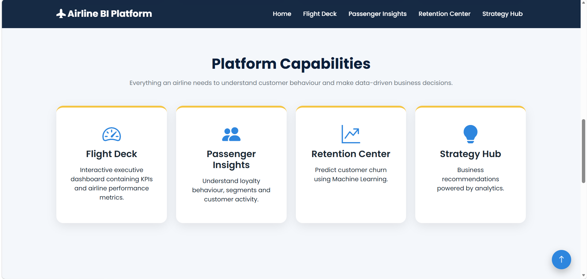
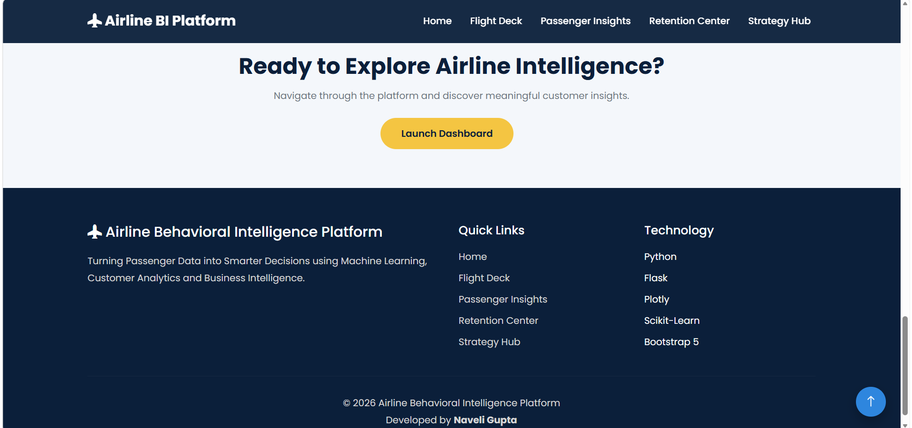
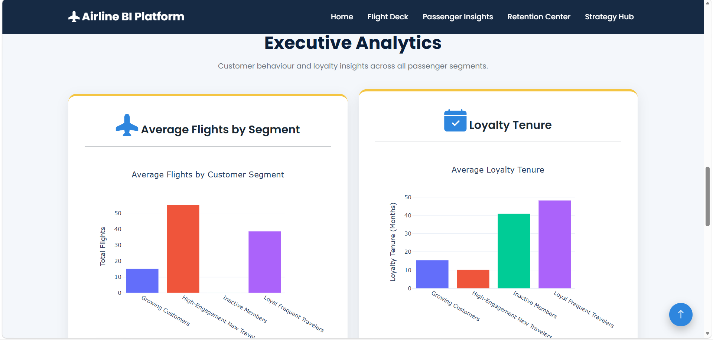
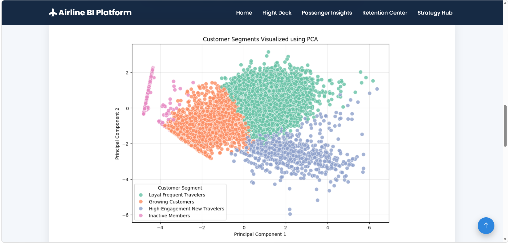
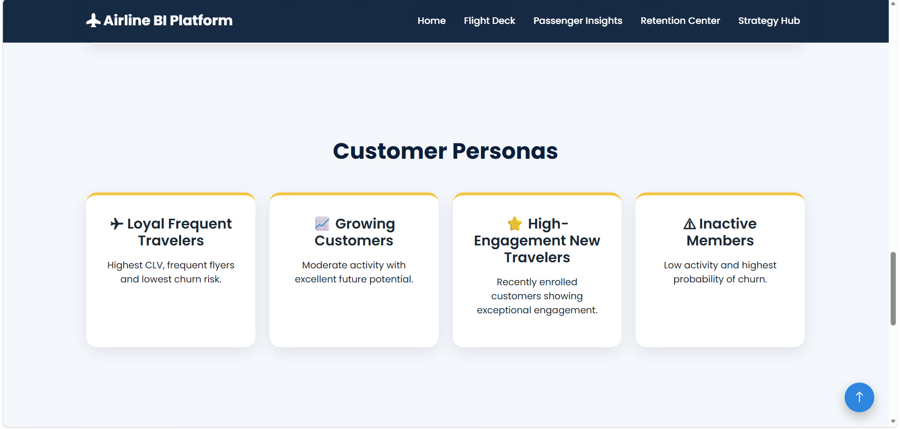
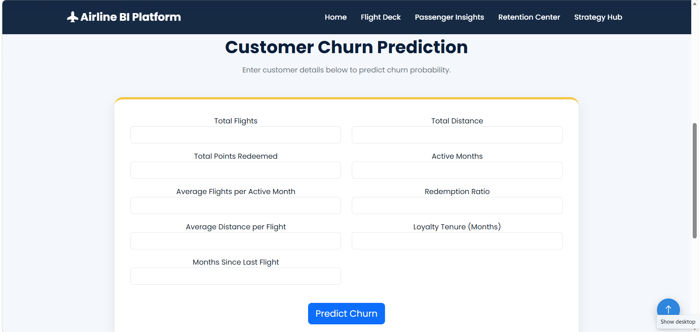
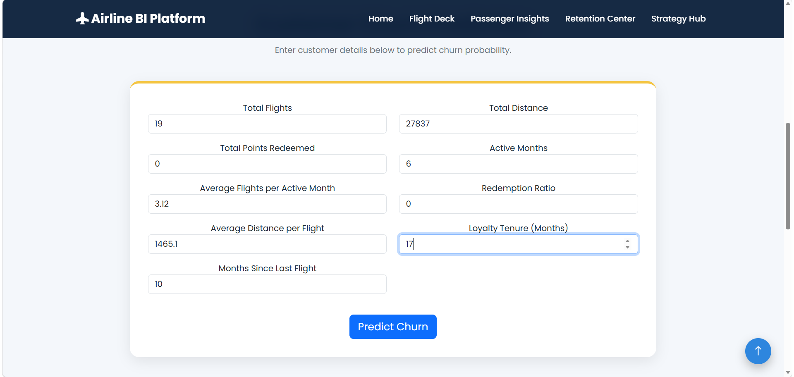
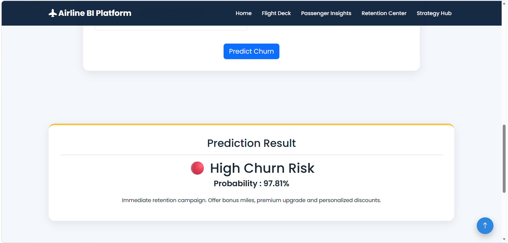
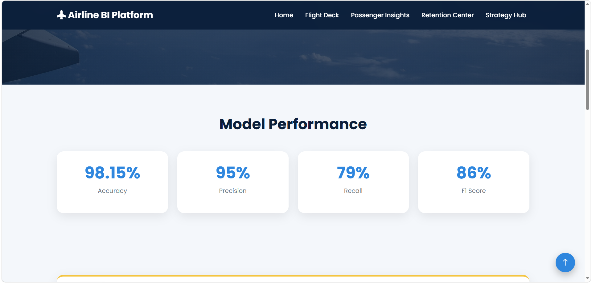

# ✈️ Airline Behavioural Intelligence Platform


An end-to-end Machine Learning and Business Intelligence platform that analyzes airline customer behaviour, segments passengers, predicts churn risk, and provides actionable retention insights through an interactive Flask web application.

## 🌐 Live Demo

🚀 **Try the application here:**

**https://airline-behavioral-intelligence.onrender.com**
---
# Application Preview

## Home Page





---

## Flight Deck



---

## Passenger Insights




---

## Retention Centre





---

## Strategy Hub



# Project Overview

The Airline Behavioural Intelligence Platform helps airlines transform customer data into business insights using Machine Learning, Customer Analytics, and Interactive Visualisations.

The platform combines:

- Customer Segmentation using K-Means Clustering
- Customer Churn Prediction using Decision Tree Classification
- Interactive Plotly Dashboards
- Flask Web Application
- Business Intelligence Insights

---

# Features

## 🏠 Home

- Modern landing page
- Platform overview
- Navigation to all modules

---

## ✈️ Flight Deck

Provides operational customer analytics, including:

- Churn Rate by Customer Segment
- Customer Activity
- Business Insights

---

## 👥 Passenger Insights

Visualizes customer segmentation, including:

- Customer Segment Distribution
- Customer Segments Visualized using PCA
- Segment-wise Business Insights

---

## 🎯 Retention Center

Machine Learning powered churn prediction.

Users can enter customer information such as:

- Total Flights
- Total Distance
- Points Redeemed
- Active Months
- Loyalty Tenure
- Months Since Last Flight

The system predicts:

- Churn Risk
- Probability of Churn
- Retention Recommendation

---

## 📊 Strategy Hub

Displays strategic insights including:

- Feature Importance
- Model-driven business recommendations
- Key factors influencing customer churn

---

# Machine Learning

## Customer Segmentation

Algorithm:

- K-Means Clustering

Generated Segments:

- Loyal Frequent Travelers
- Growing Customers
- High-Engagement New Travelers
- Inactive Members

Visualization:

- PCA Projection

---

## Churn Prediction

Algorithm:

- Tuned Decision Tree Classifier

Model Performance

| Metric | Score |
|--------|--------|
| Accuracy | 98.15% |
| Precision | 95% |
| Recall | 79% |
| F1 Score | 86% |

---

# Tech Stack

### Backend

- Flask
- Python

### Machine Learning

- Scikit-Learn
- Joblib
- NumPy
- Pandas

### Visualization

- Plotly

### Frontend

- HTML
- CSS
- Bootstrap 5

### Deployment

- Render

---

# Project Structure

```
Airline_Behavioral_Intelligence/
│
├── app.py
├── requirements.txt
├── Procfile
├── Models/
├── services/
├── routes/
├── templates/
├── static/
├── data/
└── README.md
```

---

# Dataset

The project uses the Airline Loyalty Dataset containing customer demographic, loyalty, and flight activity information.

Key features include:

- Total Flights
- Total Distance
- Loyalty Tenure
- Active Months
- Points Redeemed
- Redemption Ratio
- Customer Lifetime Value

---

# Installation

Clone the repository

```bash
git clone https://github.com/naveligupta/Airline_Behavioral_Intelligence.git
```

Move into the project directory

```bash
cd Airline_Behavioral_Intelligence
```

Install dependencies

```bash
pip install -r requirements.txt
```

Run the application

```bash
python app.py
```

Open your browser

```
http://127.0.0.1:5000
```

---

# Future Improvements

- Customer Lifetime Value Prediction
- Personalized Offer Recommendation System
- Flight Delay Prediction
- Real-Time Analytics Dashboard
- User Authentication
- Database Integration
- Explainable AI (SHAP)

---

# Developed By

**Naveli Gupta**

B.Tech | Production & Industrial Engineering

Motilal Nehru National Institute of Technology (MNNIT), Prayagraj

---

## ⭐ If you found this project interesting, consider giving it a star!
